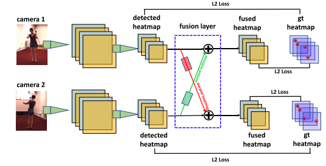
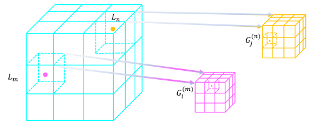
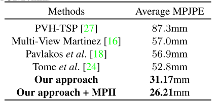
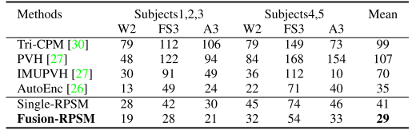

#### Cross View Fusion for 3D Human Pose Estimation, ICCV2019

##### 主要贡献

- 基于CNN的多视角特征融合
- 循环图结构模型，Recursive Pictorial Structure Model(RPSM), 从多视角下的2D pose估计出3D pose.

##### 模型

##### 细节

- 将多个视角下的特征进行融合，将空间中点p在平面一上的特征，与对应平面二极线上的特征进行融合。因为当空间点的深度未知，但是已知它在平面一的投影点位置，它在平面二上的投影点可能在极线上的任何一点。

- 使用递归图结构模型，从多视角下的2D姿态估计出3D姿态。针对三维空间离散产生的量化误差，使用递归逐步细化划分空间的方法，可以产生高精确度的位置，并且运算量小。将原始空间划分为N×N×N，细化时继续将关键点周围空间划分为2x2x2。

  

- 当每个视角下的2D姿态估计效果不好时候，RPSM也能够得出较好的3D姿态估计结果。

- 在H36M上基于MPJPE 评价指标的3D姿态估计误差。

  

- 在Total Capture上基于MPJPE 评价指标的3D姿态估计误差。

  

- 将该模型推广到其他数据集上，先使用2D姿态估计模型得到数据集的伪标签，再使用该模型估计出3D姿态。

